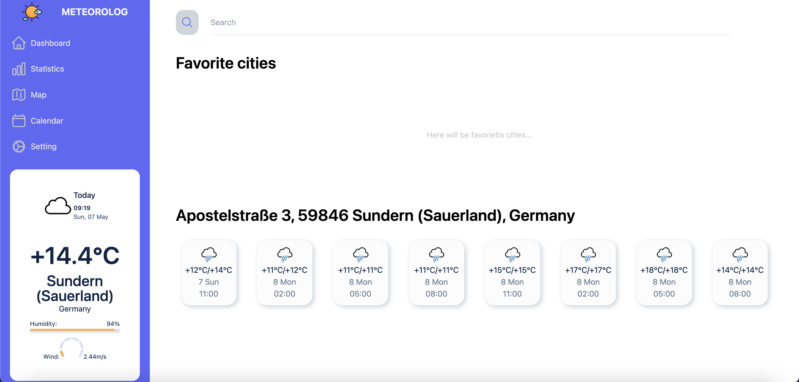
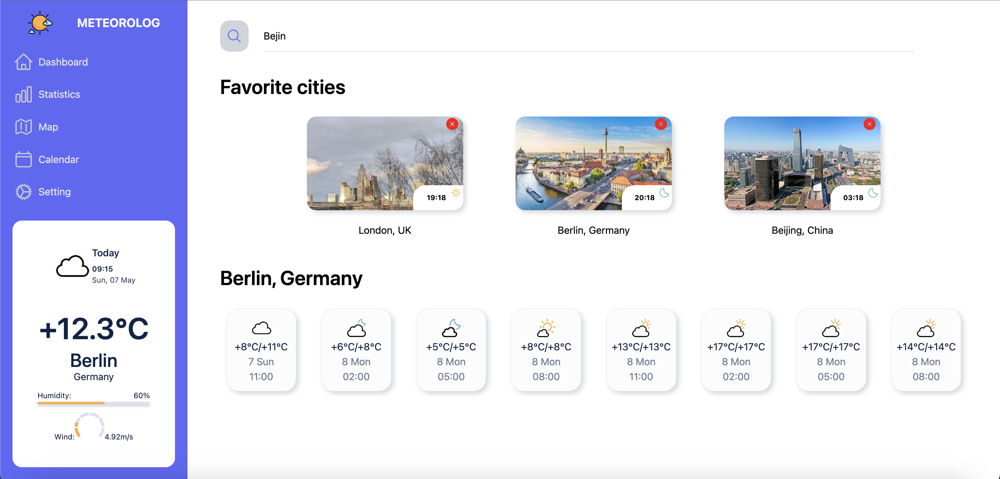

# Weather App

- [Goal](#goal)
- [User Stories](#user-stories)
- [Public API](#public-api)
- [Prerequisites](#prerequisites)
- [Application Setup](#application-setup)
- [FAQ](#faq)
- [Screenshots](#screenshots)
- [Conclusion](#conclusion)

<a name="#goal"></a>

## Goal

<hr />

The weather application developed to render detailed current weather and forecast for provided place or by user geoposition.

My personal goals were:

- Consolidate my knowledge of RTK Query through practice.
- Apply my React knowledge in practical projects.
- Utilize TypeScript in a React project.
- Explore different approaches for testing React applications.
- Revisit and apply my knowledge of Docker and Docker Compose in practical scenarios.

Solution containing:

- [x] implemented user stories [user stories](#user-stories)
- [x] followed and extended patterns provided in the task
- [ ] created some tests such as unit and e2e
- [ ] created Docker and Docker compose files for easy installation

<a name="#user-stories"></a>

## User Stories

<hr />

- As a user, I want to search cities by a provided human-readable string.
- As a user, I want to add cities that I have found to a favorite list so that I can easily access. I should be able to manage my favorite cities by adding and removing them according to my preferences.
- As a user, I want to see the current weather in a provided city or based on my current location if I grant access to the app.
- As a user, I want to see the forecast in a provided city or based on my current location if I grant access to the app.

<a name="#public-api"></a>

## Public API

<hr />

### Google Maps API

#### Get full information about place by coordinates

`[GET] https://maps.googleapis.com/maps/api/geocode/json?address=${address}&latlng=${lat},${lng}&key=${GOOGLE_API_KEY}`

#### Get timezone info by coordinates

`[GET] https://maps.googleapis.com/maps/api/timezone/json?timestamp=${timestamp}&location=${location}&key=${GOOGLE_API_KEY}`

#### Get photo reference

`[GET] https://maps.googleapis.com/maps/api/place/details/json?place_id=${placeId}&fields='photo'&key=${GOOGLE_API_KEY}`

#### Retrieve photo

`[GET] https://maps.googleapis.com/maps/api/place/photo?maxwidth=${maxwidth}&photoreference=${photoreference}&key=${GOOGLE_API_KEY}`

### Open Weather Map API

#### Get current weather

`[GET] https://api.openweathermap.org/data/2.5/weather?lat=${lat}&lon=${lng}&units=${units}&appid=${OPENWEATHERMAP_API_KEY}`

#### Get forecast

`[GET] https://api.openweathermap.org/data/2.5/forecast?lat=${lat}&lon=${lng}&units=${units}&appid=${OPENWEATHERMAP_API_KEY}`

### Sunrise Sunset API

`[GET] https://api.sunrise-sunset.org/json?lat=${lat}&lng=${lng}&formatted=${formatted}`

<a name="#prerequisites"></a>

## Prerequisites

<hr />

To run the application locally, you must have:

- Node: install [NODE](https://nodejs.org/en/download/)
- NPM/YARN should also be installed on your local system
- need to install [MongoDB Compass](https://www.mongodb.com/try/download/community) or connect through [MongoDB Atlas](https://www.mongodb.com/cloud/atlas) (free tier), but the app is being developed and tested on local database

### Repository Cloning

Once you have installed all the dependencies on your local machine, you can start cloning the repository by using HTTPS or SSH

- Frontend Part:

```
git clone https://github.com/overkektus/weather-app.git
cd weather-app
```

- Backend Part:

```
git clone https://github.com/overkektus/weather-app.git
cd weather-app
```

### Environment files (Server Directory)

Please consider replacing the API_KEY with yours inside the .env file at project `weather-app-backend` directory

https://developers.google.com/maps

`GOOGLE_API_KEY=<GOOGLE MAPS API KEY>`

This api key is being used to fetch data about city/place by coordinates, get photo of city and timezone.

<hr/>

https://openweathermap.org/weather-dashboard

`OPENWEATHERMAP_API_KEY=<OPEN WEATHER MAP API KEY>`

This api key is being used to fetch current weather and forecast.

<a name="#application-setup"></a>

## Application Setup

<hr />

This section tells you how to setup frontend and backend applications, but at this stage, the assumption is that all prerequisites are installed and running. Below the frontend and backend setup is explained separately.

### Frontend

In the project client directory, you can run the below commands to run, build and test the application.

#### `npm install`

Firstly, please install the dependencies with
`npm install #or yarn install`

#### `npm start`

In order to run the app locally (in the development mode), you can just type `npm start` in the terminal and press Enter, and the command will open the application automatically in your default browser.

The app will open in the browser at http://localhost:3000.

### Backend

In the project server directory, you should run the below commands to run, build and test the application.

#### `npm install`

Install the dependencies with
`npm install #or yarn install`

#### `npm start`

In order to run the app locally (in the development mode), you can just type `npm start:dev` in the terminal and press Enter, and the command will open the application.

The app will be served at http://localhost:5000, because this port is default.

<a name="#faq"></a>

## FAQ

<hr />

### Which technologies I used for client-side application?

The frontend application is developed on the below technologies, such as:

- React
- Redux
- RTK Query
- Styled Components
- Cypress

### Which technologies I used for server-side application?

The backend server is developed on the below technologies, such as:

- Nest JS
- MongoDB (primary database)
- Mongoose (DB schema)
- Axios
- Swagger

### Has the OAS3(Open Api specification) been implemented??

Yes, I implemented OAS3. It's covered parameters and body's of requests. And some requests containes examples.

<a name="#screenshots"></a>

## Screenshots

<hr />

The screenshots of the application are as follows:





<a name="#conclusion"></a>

## Conclusion

<hr />

I consolidated my knowledge as a Full Stack TypeScript developer and explored new concepts, such as testing React applications. In this project, I intentionally avoided using pre-built components from popular component libraries. While this approach may not have been ideal from a business perspective, it allowed me the freedom to experiment and learn. Time constraints were not a concern for this project, so I took the opportunity to explore unfamiliar territory and reinforce my existing knowledge.
